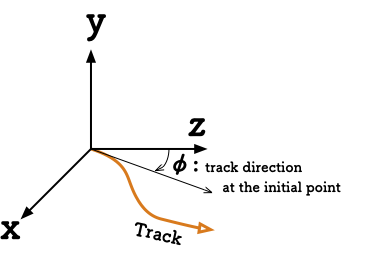

================
CFG file format
================

*******************
[@TSUTSUJI_GENERAL]
*******************

owntrack
=========
* type: string
* 自軌道として扱うtrackkey
    
unit_length
============  
* type: float
* 各軌道について軌道座標を計算する間隔 [m]

  * デフォルトでは1 [m]

* この数値によって軌道位置の計算精度が決まる
  
  * 極端に小さな値を設定すると、計算に必要なメモリ、時間が大幅に増えるので注意

offset_variable
================  
* type: string
* 変換結果の距離程を :code:`$offset_variable + distance;` の形で表すときの変数名。

  * 省略した場合はdistanceのみで表す。

origin_distance
================  
* type: float

  * offset_variableで指定した変数に代入する数値

output_path
============
* type: filepath
* 変換結果を保存するディレクトリへのパス

  * cfgファイルが置かれた場所からの相対パスで記述する
  * 省略した場合は :code:`./result`

backimg
========
* type: filepath
* 線形データ読み込み時に表示する背景画像設定ファイルへのパス

  * 背景画像メニュー -> save... で出力されるファイルを指定する

************
[*trackkey*]
************

* *trackkey* : 読み込む軌道データに与える軌道キー

file
===========
* type: filepath
* *trackkey* として読み込むmapファイルパス
* **省略不可**

absolute_coordinate
===================
* type: bool
* 軌道始点座標の指定方法
  
  * True: 絶対座標系
  * False: 別軌道のある距離程を基準とした座標系

    * `parent_track` で指定した軌道の距離程\ `origin_kilopost` の座標を原点として、\ `x` ,\ `y` ,\ `z`  で指定した距離オフセットした位置を軌道始点とする

parent_track
============
* type: string
* 座標系の原点となる軌道のtrackkey
* **absolute_coordinate == Falseの場合にのみ有効**

origin_kilopost
===============
* type: float
* 座標系の原点となる距離程
* **absolute_coordinate == Falseの場合にのみ有効**
 
x
==========
* type: float
* 軌道始端座標のx成分 [m]
  
y
===========
* type: float
* 軌道始端座標のy成分 [m]
  
z
===========
* type: float
* 軌道始端座標のz成分 [m]
  
angle
===========
* type: float
* 軌道始端における進行方向 [°]
* `absolute_coordinate = True` の場合、絶対座標系のz軸方向を0とする
* `absolute_coordinate = False` の場合、相対座標系のz軸方向(指定された距離程での軌道の向き)を0とする
  
  
* x, y, z, angle については下図を参照

  * 下図のTrack A, B始端座標について

    * Track Aの(x, y, z, φ) = (0, y\ :sub:`0`\, z\ :sub:`0`\, 0)
    * Track Bの(x, y, z, φ) = (x\ :sub:`0`\, y\ :sub:`0`\, z\ :sub:`0`\, φ\ :sub:`0`\)
  

isowntrack
===========
* type: bool
* この軌道を自軌道とする場合にTrue

  * [@TSUTSUJI_GENERAL]のowntrackを設定した場合は記述不要
  * 両方を記述した場合は最後に記述したものが反映される

endpoint
===========
* type: float
* 軌道終点の距離程 [m]

supplemental_cp
================
* type: float, float, ..., float
* 制御点として追加する距離程

  * コンマ区切りリストで記述する
  * 注目している軌道基準での該当する距離程でTrack構文を出力する

color
======
* type: string
* 軌道プロット時の線色

  * 16進数カラーコード('#rrggbb')または色名で指定
  * デフォルトでは読み込んだ軌道ごとに下記の順序で設定
    
    * .. image:: ./files/color_default.png
	   :scale: 50%
      
  * 指定できる色名

    * https://matplotlib.org/2.0.2/examples/color/named_colors.html をもとに作成
    * .. image:: ./files/namedcolor.png
	   :scale: 75%
