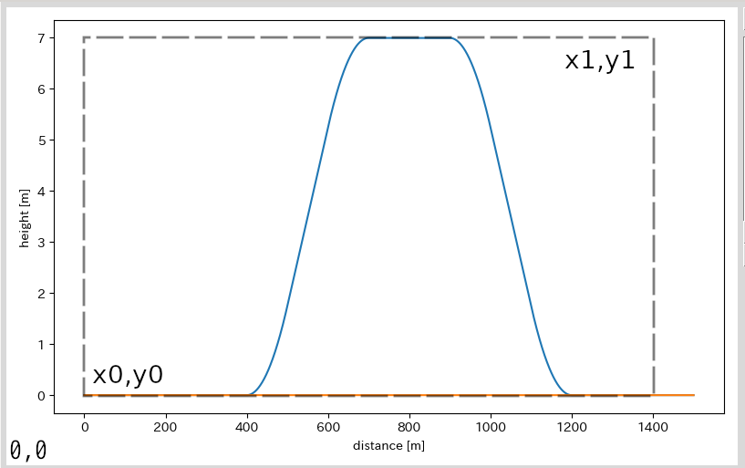

=============
高度ウィンドウ
=============

.. image:: ./files/height_window.png
	   :scale: 60%

プロットウィンドウ
----------------

各軌道について、横軸：距離程 [m]、縦軸：高度 [m]としたプロットを表示します。

Replotボタン
------------

プロットウィンドウの再描画を行います。
このボタンを押した場合、高度プロットのみの再描画を行います。

Plot control
--------------

* dist

  * プロットする距離程範囲を指定する
  * auto
    
    * On:

      * 読み込んだ軌道が全て表示される範囲に自動設定する
	
    * Off

      * min, maxへ入力した値が有効になる

* ht.

  * プロットする高度範囲を指定する
  * auto

    * On

      * 読み込んだ軌道が全て表示される範囲に自動設定する
    * Off

      * min, maxへ入力した値が有効になる

* ←, →ボタン

  * 矢印の方向に表示範囲を移動する（距離程のみ）
  * dist, autoがチェックされていない場合のみ有効

* Symbols

  * radius

    * Curve要素が指定されている座標にマーカー(●)を描画する

  * gradient

    * Gradient要素が指定されている座標にマーカー(▲)を描画する

  * supplemental_cp

    * supplemental_cpが指定されている座標にマーカー(✖)を描画する

  * track

    * track要素が指定されている座標にマーカー(+)を描画する

.. _ref_height_menu_backimg:

Backimg ボタン
--------------

.. image:: ./files/height_backimg.png
	   :scale: 60%
		   
高度プロットウィンドウの背景画像を管理するウィンドウを表示します。

.. _ref_height_menu_measure:

ファイル操作
^^^^^^^^^^^^^

* Add

  * ファイルダイアログを開き、表示したい画像ファイルを選択する
  * 選択した画像ファイルはfilepathリストに表示される
    
* Delete

  * filepathリストで選択した画像を削除する
  
* Refresh

  * 変更した下記パラメータを反映する

表示パラメータ
^^^^^^^^^^^^^^

filepathリストで選択した画像毎に下記のパラメータを設定できます。
  
* x0, y0, x1, y1

  * 画像内で配置基準となる座標を指定

    * x0: 距離程dist0となる座標
    * x1: 距離程dist1となる座標
    * y0: 高度h0となる座標
    * y1: 高度h1となる座標
    
  * **画像左下を原点** として[pixel]単位で指定

* dist0, h0, dist1, h1

  * プロットウィンドウ上で画像上の座標x0, y0, x1, y1が該当する座標を指定

    * dist0: 画像上x=x0が位置する距離程
    * dist1: 画像上x=x1が位置する距離程
    * h0: 画像上y=y0が位置する高度
    * h1: 画像上y=y1が位置する高度
      

           x0, y0, x1, y1とdist0, h0, dist1, h1 の位置関係

* alpha

  * 透過率を0~1で指定

* Show

  * チェックした画像を表示する
  

Measure ボタン
--------------

.. image:: ./files/height_measure.png
	   :scale: 60%

設定保存
^^^^^^^^^

メニュー/高度/Save backimg... で、高度ウィンドウ背景画像の設定をファイルに書き出します。

設定読み込み
^^^^^^^^^^^^

メニュー/高度/Load backimg... で、保存した高度ウィンドウ背景画像の設定ファイルを読み込みます。

メニュー
---------

Display...
+++++++++++

Measure...
+++++++++++

aaa

Backimg...
+++++++++++

bbb

.. _ref_height_menu_loadbackimg:

Load Backimg...
++++++++++++++++

ccc

.. _ref_height_menu_savebackimg:

Save Backimg...
++++++++++++++++

ddd
