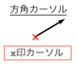
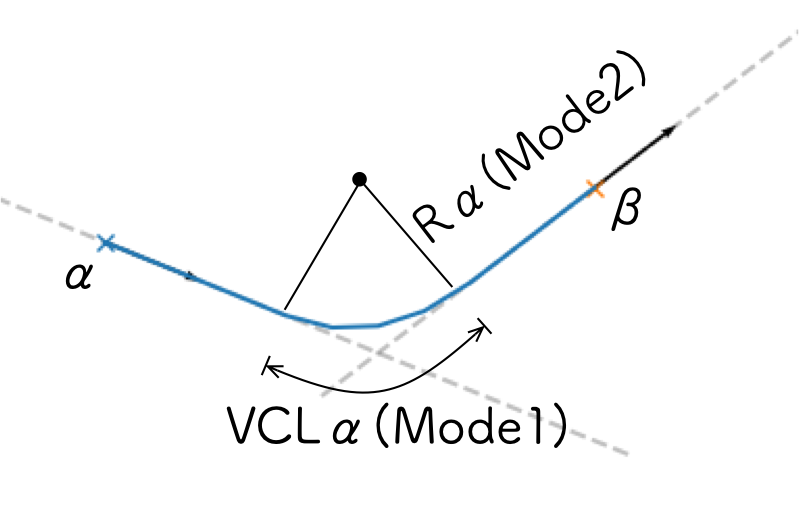
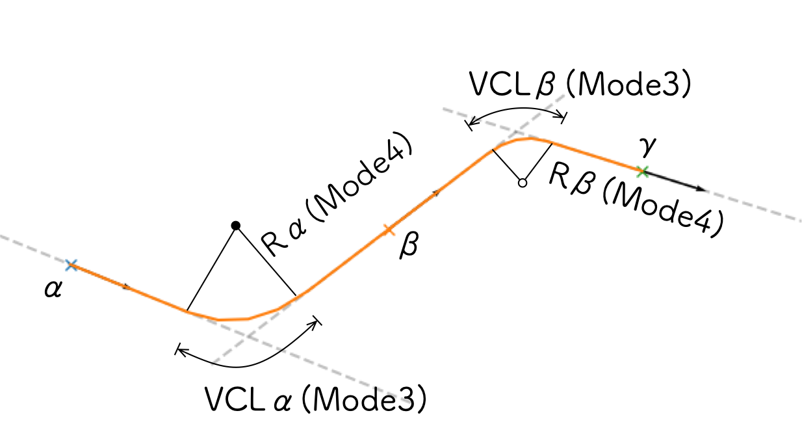

======================
Measureウィンドウ(高度)
======================

.. image:: ./files/height_measure.png
	   :scale: 60%

カーソル機能
=============

プロットウィンドウ上の座標(距離, 高度)と勾配を調べる機能です。
任意の数のカーソルを設定できます。

Addボタン
-----------

Addボタンを押すと、プロットウィンドウ上に新しいx印カーソルを作成し、左クリックするまでの間マウスで位置を動かせます。
新しく作成したカーソルにはIDが割り振られ、カーソルリスト(1)にデータが表示されます。
カーソルが指し示す位置の距離程、高度は、カーソルリストのDistance, Heightフィールドに表示されます。

Trackボックスで `@absolute` が指定されている場合、カーソルはプロットウィンドウの任意の位置に動かせます。

Trackボックスで `任意の軌道キー` を選択している場合、カーソルは選択した軌道上のみを動かせます。
このとき、カーソルが示す地点の軌道勾配がGradientフィールドに表示されます。

Grad.ボタン
-----------

カーソルリストで選択したカーソルについて、方角カーソルをマウスで指し示した方向に動かせます。
マウスを動かしている間、方角カーソルが示す角度に対応した勾配(単位: [‰])がリストのGradientフィールドに表示されます。
方角カーソルは左クリックするまで動かせます。

リストで選択したカーソルのTrack: `@absolute` の場合、方角カーソルは距離程正の自由な方向（±90°以内）に向けられます。

リストで選択したカーソルのTrack: `任意の軌道キー` の場合は、方角カーソルは動きません。

Moveボタン
-----------

カーソルリストで選択したカーソルについて、左クリックするまでの間マウスで示した位置に動かせます。

Editボタン
-----------

カーソルリストで選択したカーソルについて、パラメータをEditフィールド(2)で指定した値に変更します。

Track: `@absolute` の場合、Distance, Height, Gradient, Color全ての値を変更できます。

Track: `任意の軌道キー` の場合は、Distance, Colorのみが変更可能です。

Deleteボタン
-----------

カーソルリストで選択したカーソルを削除します。

Loadボタン
-----------

下記Saveボタンで書き出したxmlファイルを読み込み、カーソル情報をカーソルリストとプロット画面に復元します。
Gradient Solverの実行結果も同時に復元されます。

Loadを実行すると、カーソルリスト・Solverリストの内容は消去され、xmlファイルから読み込んだ内容に書き換えられます。

Saveボタン
-----------

作成したカーソルの情報をxmlファイルに書き出します。
同時に、Gradient Solverの実行結果も同じファイルに書き出します。

Gradient Solver
================

α,β,γボックスで選択したカーソルを通る最適な勾配軌道を探索します。

α,β,γに割り当てたいカーソルのIDをα,β,γボックスで選択し、計算Modeを選択してDo Itボタンを押すと、計算結果がプロットウィンドウとParameters, Syntaxフィールドに表示されます。

Parametersフィールドには計算条件を、SyntaxフィールドにはGradient構文で示した計算結果を表示します。
表示内容はそれぞれCopy params, Copy syntaxボタンでクリップボードへコピーできます。

計算結果にはID, Colorが割り振られ、Solverリスト(3)に表示されます。

Colorボタン
-----------

リストで選択した計算結果について、プロットウィンドウへ表示するラインカラーを変更します。
クリックするとカラーピッカーが表示され、任意のカラーを指定できます。

Deleteボタン
-----------

リストで選択した計算結果を削除します。

Mode
-----

計算Modeは次の通りです。

* 1. α->β, given VCLα

  * カーソルαの延長線上に起点、カーソルβの延長線上に終点を持つ、縦曲線長VCLαの勾配軌道を求める
    
* 2. α->β, given Rα

  * カーソルαの延長線上に起点、カーソルβの延長線上に終点を持つ、縦曲線半径Rαの勾配軌道を求める

		   
* 3. α->β->γ, given VCLα,β

  * カーソルαの延長線上に起点、カーソルβの延長線上に終点を持つ縦曲線長VCLαの勾配軌道、カーソルβの延長線上に起点、カーソルγの延長線上に終点を持つ縦曲線長VCLβの勾配軌道を同時に求める。
  
* 4. α->β->γ, given Rα,β

  * カーソルαの延長線上に起点、カーソルβの延長線上に終点を持つ縦曲線半径Rαの勾配軌道、カーソルβの延長線上に起点、カーソルγの延長線上に終点を持つ縦曲線半径Rβの勾配軌道を同時に求める
