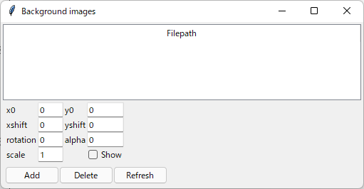

=============================
Reference for Mainwindow
=============================

メインウィンドウ
===============

.. image:: ./files/mainwindow.png
	   :scale: 60%

プロット制御パネル
-----------------

* x, y

  * プロットの中心座標を指定する
  * 単位は[m]

* scale

  * x軸方向の表示範囲を指定する
  * 単位は[m]
  * デフォルトは1000 m

* Y. Mag.

  * x軸方向に対するy軸方向の拡大率を指定する
  * デフォルトは1

* ↑↓←→ボタン

  * 矢印の方向に表示範囲を移動する

* Replotボタン

  * プロットウィンドウの再描画を行う
  * x, y, scale, Y. Magの値を変更した場合、Replotを実行するまで反映されない

Measureボタン
-------------

.. image:: ./files/measure.png
	   :scale: 60%

Measureウィンドウを開きます。
詳細は :doc:`reference_measure` を参照。

Generateボタン
--------------

cfgファイルの設定に従い、他軌道構文データを出力します。
デフォルトではcfgファイルと同じ階層のresultディレクトリに結果を保存します。
  
メニュー
===========
		   
ファイル
-----------

開く...
++++++++

cfgファイルを指定するファイルダイアログを表示します。
指定したcfgファイルに基づいて各mapファイルを読み込み、各軌道毎の座標データをプロットウィンドウに表示します。

リロード
++++++++

一旦開いたcfgファイルを再読み込みします。
cfgファイルで指定された各mapファイルも全て再読み込みされ、軌道座標データを再構築します。

終了
+++++++

Tsutsujiを終了します。

背景画像
--------

window...
++++++++++

プロットウィンドウの背景に表示する画像を管理するBackground imagesウィンドウを開きます。

ファイル操作
^^^^^^^^^^^^^

* Add

  * ファイルダイアログを開き、表示したい画像ファイルを選択する
  * 選択した画像ファイルはfilepathリストに表示される
    
* Delete

  * filepathリストで選択した画像を削除する
  
* Refresh

  * 変更した下記パラメータを反映する

表示パラメータ
^^^^^^^^^^^^^^

filepathリストで選択した画像毎に下記のパラメータを設定できます。
  
* x0, y0

  * 画像中心となる座標を指定
  * 単位は[pixel]
  
* xshift, yshift

  * 画像を配置する座標を指定
  * 単位は[m]

* rotation

  * 回転角度を指定
  * 単位は[°]

* alpha

  * 透過率を0~1で指定

* scale

  * 拡大率を指定
  * 単位は [m/pixel]

    * 画像ファイル上での106 pixelを20 mとして表示したいときは、20/106 = 0.188を指定する

* Show

  * 画像を表示するかどうか

load...
++++++++

save...で書き出した設定ファイルを読み込みます。

save...
++++++++

現在読み込まれている背景画像の設定を書き出します。

ヘルプ
---------

ヘルプ...
+++++++++

システム規定のwebブラウザで https://konawasabi.github.io/tsutsuji-trackcomputer/ を表示します。

Tsutsujiについて...
+++++++++++++++++++

バージョン情報を表示します。
