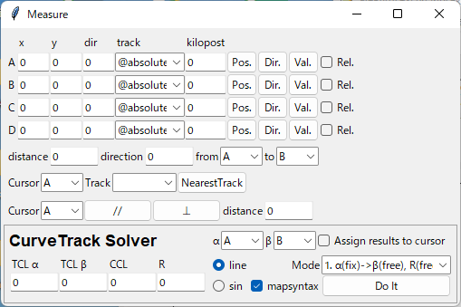

======================
Measure ウィンドウ
======================

カーソル機能
===========

プロットウィンドウ上の座標と方角を調べる機能です。
A-Dの4つのカーソルをそれぞれ独立に操作できます。

マウスでの操作
-------------

位置を調べる
++++++++++++

Pos.ボタンを押すと、プロットウィンドウ上にx印カーソルが現れ、左クリックするまでの間マウスで位置を動かせます。
マウスでカーソルを動かしている間、カーソルの座標がx,yフィールドに表示されます（単位は[m]）。

trackボックスで `@absolute` が指定されている場合は、カーソルはプロットウィンドウ内を自由に移動できます。

軌道上の座標を調べたい時は、trackボックスで軌道キーを選択してからPos.ボタンを押すと、対象の軌道に沿ってカーソルを動かせます。
このとき、カーソルが示す地点の距離程がkilopostフィールドに表示されます（単位は[m]）。

方角を調べる
+++++++++++

Dir.ボタンを押すと、プロットウィンドウ上に方角カーソルが現れ、左クリックするまでの間マウスで方角を動かせます。
マウスで方角を動かしている間、カーソルの方角がdirフィールドに表示されます(単位は[°])。

trackボックスで `@absolute` が指定されている場合は、方角カーソルは360°自由な方向に向けられます。

trackボックスで軌道キーを選択している場合は、方角カーソルはx印カーソルが示している地点の軌道の向きにのみ向けられます。

.. image:: ./files/cursor_arrow.png

カーソル座標の手入力
-------------------

Val.ボタンを押すと、x, y, dir, kilopostフィールドに入力した値に基づいてカーソルの位置と方角を設定します。

trackボックスで `@absolute` が指定されている場合は、x, y, dirフィールドの内容が反映されます。

trackボックスで軌道キーを指定している場合は、kilopostで指定した距離程上にカーソルが移動します。
この時x, y, dirフィールドの内容は無視されます。

Rel.をチェックしてからVal.ボタンを押すと、下記のset offsetダイアログが現れ、カーソルの現在位置に対して指定した値だけ位置と方角をオフセットできます。
座標系の取り方は下記を参照してください。
この機能はtrackボックスで軌道キーを選択している場合のみ有効です。

.. image:: ./files/cursor_setoffset.png

.. image:: ./files/cursor_setoffset_coordinate.png

測量機能
========

distance, direction
---------------------

from, toボックスで選択した2つのカーソル間の距離、方角を表示します。

Pos., Dir.ボタンで選択したカーソルを動かしている間、値は自動で更新されます。
また、左クリックした時点での距離と方角がターミナルに印字されます。

NearestTrack
--------------

Cursorボックスで選択したカーソルに対して、trackボックスで選択した軌道上で最もカーソルに近い点を探索します。

カーソルと軌道を選択してNearestTrackボタンを押すと、下図のようにカーソルと軌道上の最近接点間にラインが引かれ、探索結果（最近接点に該当する距離程、カーソルとの距離）がターミナルに印字されます。

プロットウィンドウに引かれたラインは、メインウィンドウのReplotを実行すると消去できます。

\/\/, ⊥
--------

Cursorボックスで選択したカーソルに対して、方角カーソルが示す方角に応じた距離の測定を行います。

\/\/ボタンを押すと、方角カーソルに沿った方向に動くカーソル(緑色)が現れ、親カーソルとの距離がdistanceフィールドに表示されます。
左クリックすると、その時点での測定データがターミナルに印字され、測定を終了します。

⊥ボタンを押すと、方角カーソルと直交する方向に動くカーソル(緑色)が現れ、\/\/の場合と同じような測定ができます。

.. image:: ./files/cursor_along_across.png

.. _ref_measure_ctsolver:

CurveTrack Solver
===================

α,βボックスで選択したカーソルを通る最適な曲線軌道を探索します。

2つのカーソルの位置と方角を決め、Modeを選択してDo Itボタンを押すと、計算結果がプロットウィンドウとターミナルに出力されます。

計算結果はCurve構文の形でも出力されます。
mapsyntaxチェックを外すと、Curve構文での出力を停止します。

プロット画面の曲線軌道計算結果は、メインウィンドウのReplotボタンを押すと消去されます。

緩和曲線つきの曲線軌道を計算する場合は、TCL α, TCL βフィールドに曲線前後の緩和曲線長を入力し、逓減関数をline/sinラジオボタンで選択しておきます。

.. _ref_measure_ctsolver_mode:

Mode
-----

計算Modeは次の5種類から選べます。

* 1. α(fix)->β(free), R(free)

  * カーソルαを起点として、カーソルβの延長線上に終点をもつ曲線軌道の半径Rを求める

* 2. α(free)->β(fix), R(free)

  * カーソルβを終点として、カーソルαの延長線上に始点を持つ曲線軌道の半径Rを求める

* 3. α(free)->β(free), R(fix)

  * Rフィールドに入力された半径Rの曲線軌道について、カーソルα, βの延長線上に始点, 終点を持つものを求める
  * 求めた軌道について、軌道始点とカーソルαとの距離を出力する

* 4. α(fix), R(fix), CCL(fix)

  * カーソルαを起点とする半径R, 円曲線長CCLの曲線軌道について、終点座標を求める
  * Assign results to cursorをチェックしている場合は、カーソルβを求めた終点座標に設定する

  
* 5. β(fix), R(fix), CCL(fix)

  * カーソルβを終点とする半径R, 円曲線長CCLの曲線軌道について、起点座標を求める
  * Assign results to cursorをチェックしている場合は、カーソルαを求めた起点座標に設定する

.. image:: ./files/curvetracksolver.png

.. image:: ./files/curvetracksolver_4_5.png

計算結果の出力例
---------------

上の図でMode 3の計算を行った場合のターミナル出力は以下の通りです。
# から始まる文は説明のために書き加えたもので、実際には出力されません。

.. code-block:: text

   [Curve fitting]
   Inputs:
      Fitmode:          3. α(free)->β(free), R(fix)
      Cursor α,β:       A,B
      Ponint α:         (-109.225328, 12.428684)
      Ponint β:         (139.534313, 46.285293)
      Direction α:     33.036680
      Direction β:     -40.175224
      Transition func.: line
      TCL α:            0.000000
      TCL β:            0.000000
      R:                -400.000000
   Results:
      CCL:        511.115511                # 円軌道の長さ
      startpoint: (-195.139998, -43.443185) # 始点座標
      shift:      -102.484127               # 始点座標とカーソルαの距離
   
   # ここからCurve構文の出力
   $pt_a -102.484127;                       # $pt_aはカーソルαの位置の距離程を想定
   Curve.SetFunction(1);
   Curve.Interpolate(0.000000,0.000000);
   $pt_a -102.484127;
   Curve.Interpolate(-400.000000,0.000000);
   $pt_a +408.631384;
   Curve.Interpolate(-400.000000,0.000000);
   $pt_a +408.631384;
   Curve.Interpolate(0.000000,0.000000);

