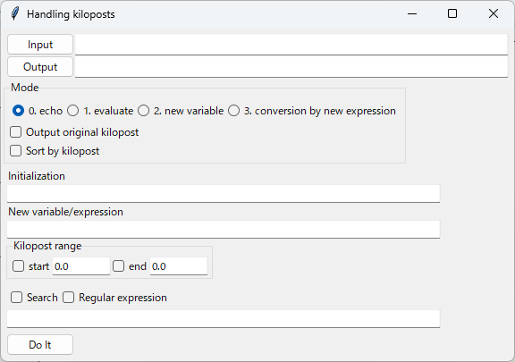
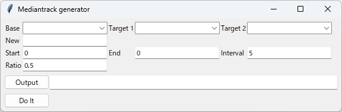

===========
メニュー
===========
		   
ファイル
-----------

開く...
++++++++

cfgファイルを指定するファイルダイアログを表示します。
指定したcfgファイルに基づいて各mapファイルを読み込み、各軌道毎の座標データをプロットウィンドウに表示します。
cfgファイルの詳細については、 :doc:`cfgfileformat` を参照してください。

リロード
++++++++

一旦開いたcfgファイルを再読み込みします。
cfgファイルで指定された各mapファイルも全て再読み込みされ、軌道座標データを再構築します。

終了
+++++++

Tsutsujiを終了します。

メイン処理
----------

Measure...
+++++++++++

Measureウィンドウを開きます。
メインウィンドウのMeasureボタンと同じ動作をします。

Generate
+++++++++++

cfgファイルの設定に従い、他軌道構文データを出力します。
メインウィンドウのGenerateボタンと同じ動作をします。

Replot
+++++++

プロットウィンドウの再描画を行います。
メインウィンドウのReplotボタンと同じ動作をします。

高度
----------

Display...
+++++++++++

.. image:: ./files/height_window.png
	   :scale: 60%

:doc:`reference_height` を表示します。

Measure...
++++++++++++++++

.. image:: ./files/height_measure.png
	   :scale: 60%

:ref:`ref_height_menu_measure` を参照してください。

Backimg...
+++++++++++

.. image:: ./files/height_backimg.png
	   :scale: 60%

:ref:`ref_height_menu_backimg` を参照してください。

Load Backimg...
++++++++++++++++

:ref:`ref_height_menu_loadbackimg` を参照してください。

Save Backimg...
++++++++++++++++

:ref:`ref_height_menu_savebackimg` を参照してください。

オプション
----------

Backimg...
++++++++++

.. image:: ./files/backimg.png
	   :scale: 60%

プロットウィンドウの背景に表示する画像を管理するBackground imagesウィンドウを開きます。

ファイル操作
^^^^^^^^^^^^^

* Add

  * ファイルダイアログを開き、表示したい画像ファイルを選択する
  * 選択した画像ファイルはfilepathリストに表示される
    
* Delete

  * filepathリストで選択した画像を削除する
  
* Refresh

  * 変更した下記パラメータを反映する

表示パラメータ
^^^^^^^^^^^^^^

filepathリストで選択した画像毎に下記のパラメータを設定できます。
  
* x0, y0

  * 画像中心となる座標を指定
  * 単位は[pixel]
  
* xshift, yshift

  * 画像を配置する座標を指定
  * 単位は[m]

* rotation

  * 回転角度を指定
  * 単位は[°]
  * x0, y0で指定した座標を中心に回転する

* alpha

  * 透過率を0~1で指定

* scale

  * 拡大率を指定
  * 単位は [m/pixel]

    * 例: 画像ファイル上での106 pixelを20 mとして表示したいときは、20/106 = 0.188を指定する

* Show

  * チェックした画像を表示する

Load Backimg...
++++++++++++++++

Save Backimg...で書き出した設定ファイルを読み込みます。

Save Backimg...
++++++++++++++++

現在読み込まれている背景画像の設定をファイルに書き出します。

----

Maptile...
+++++++++++

.. image:: ./files/maptileparamwindow.png
	   :scale: 60%

背景画像として取得するマップタイルのパラメータ設定ウィンドウを開きます。

設定できるパラメータの詳細は :ref:`ref_cfg_maptile` を参照してください。

* longitude, latitude

  * tsutsuji上の座標(x0, y0)に対応するマップタイルの経度, 緯度

* x0, y0

  * longitude, latitudeで指定したマップタイル上の点のtsutsuji上での座標

* zoomlevel

  * 取得するマップタイルのズームレベル

* alpha

  * マップタイルの透過率

* template_url

  * マップタイルのテンプレートURL

* toshow

  * マップタイルを取得・表示するときにOn

* autozoom

  * プロットウィンドウの表示範囲に合わせてズームレベルを自動設定する機能のOn/Off

Refresh Maptile
+++++++++++++++++

現在プロットウィンドウで表示している範囲に対応するマップタイルを取得し表示します。

Maptile... にてtoshowがチェックされていない場合は、マップタイルの取得・表示を行いません。

マップタイルの取得状況は次の要領でターミナルに印字されます。

.. code-block:: text

  num/Total https://url/to/tile/data/z/x/y.png STATUS

* num: 現在取得したタイル数

* Total: 取得するタイルの総数

* STATUS: タイル取得状況の表示

  * なし

    * 正常に取得完了

  * cached

    * 以前に取得したタイルデータを再利用

  * ERROR

    * テンプレートURLに誤りがある、インターネット接続に問題がある、取得した画像データが壊れているなどの理由によりタイル取得に失敗

Export Maptile...
++++++++++++++++++

現在プロットウィンドウで表示しているマップタイルをファイルに書き出します。
実行すると、マップタイルの画像データとLoad Backimg...で読み込める設定ファイルを出力します。
      
----

Track...
+++++++++

.. image:: ./files/trackwindow.png
	   :scale: 60%

軌道の描画設定を行うTrackウィンドウを開きます。

ツリー構成
^^^^^^^^^^^^^^^^^^

rootツリーには、cfgファイルで指定したmapファイルを表示します。

generatedツリーには、Generateボタンで生成された他軌道データを表示します。

チェックボックス
^^^^^^^^^^^^^^^^^^^^

チェックされた軌道をプロットウィンドウに描画します。
最上段(root, generated)で全てのチェックを一括してOn/Offできます。
デフォルトでは全てOnです。

Color
^^^^^^^

各軌道に割り当てられた色を表示します。
■■■をクリックするとカラーピッカーが表示され、割り当てる色を変更できます。

----

Handling kiloposts...
++++++++++++++++++++++

		   
:doc:`handlingkp` を開きます。

----

Mediantrack...
+++++++++++++++

		   
:doc:`mediantrack` を開きます。

ヘルプ
---------

ヘルプ...
+++++++++

システム規定のwebブラウザで https://konawasabi.github.io/tsutsuji-trackcomputer/ を表示します。

Tsutsujiについて...
+++++++++++++++++++

バージョン情報を表示します。
