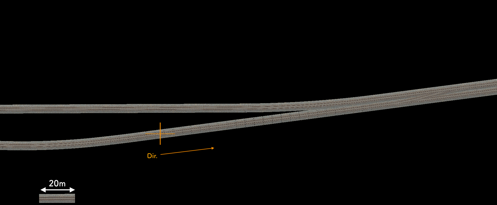
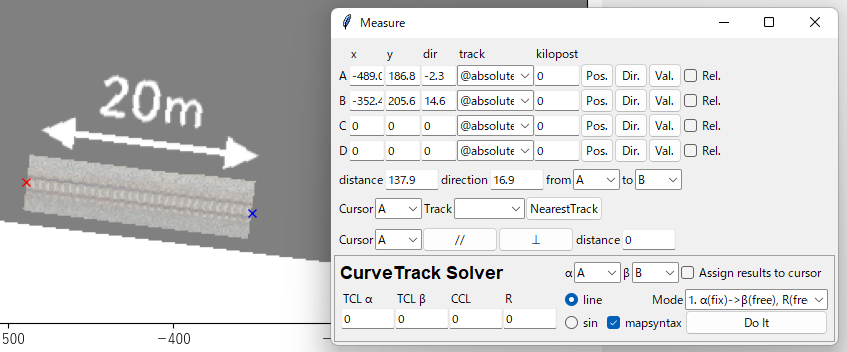

==========
背景画像
==========

はじめに
========

このセクションでは、以下の画像をプロットウィンドウの背景(backimg)に表示し、表示倍率と回転角度を調整する手順を説明します。
この機能は、航空写真や配線図を基にして軌道データを調整することを意図しています。

画像の読み込み
=============

オプションメニューからBackimg... を実行して、Background imagesウィンドウ(下記画像)を開きます。
Addボタンを押して表示したい画像ファイルを選択すると、その画像がプロットウィンドウに表示されます。

.. image:: ./files/backimg.png
	   :scale: 75%

画像ファイルの形式は、少なくともpng, jpg, bmpに対応しています。
matplotlibが扱えるフォーマットならば、これ以外の形式も読み込めるはずです。

.. note::

   デフォルト設定では、alpha(透明度)は0.5に設定されています。
   また、画像の表示／非表示はShowチェックボックスで選択できます。
   これらの設定を変更した場合は、Refreshをクリックすると反映されます。

基準座標の測定
==============

読み込んだ画像について、十字マーク(オレンジ色)を座標原点として、軌道の方向をx軸正の向きに合わせるため、該当部分の画像上での座標と方角を測定します。

メインウィンドウのMeasureボタンを押して、Measureウィンドウを開きます。

カーソルAのPos. を実行して、出てきたx印カーソルを十字マークの中心に合わせてクリックします。
続いて、Dir. を実行して、方角カーソルを軌道の方向に合わせてクリックします。
これで、十字マーク周りの測定結果がMeasureウィンドウのx, y, dir.フィールドに表示されます。

.. image:: ./files/tutorial/backimg_measure.png
	   :scale: 50%

測定結果を背景画像に反映させます。
Background imagesウィンドウを開いて、Filepathリストから先ほど読み込んだファイルを選択し、各パラメータを次の表のように設定してRefreshをクリックします。

.. csv-table::
   :header: "パラメータ", "設定値", "備考"

	    "x0", 610.9, "測定したxと同じ"
	    "y0", 510.5, "　｀｀　yと同じ"
	    "rotation", 7.2, "測定したdirの逆符号"

.. image:: ./files/tutorial/backimg_moved.png
	   :scale: 50%

上図のように、十字マークの位置が座標原点に移動し、軌道の向きとx軸の方向が一致します。

.. note::

   ここでは、デフォルト設定では 画像の1pixel = プロット上の1m として扱われることを利用して、measure機能で測った距離をそのままx0, y0に設定しています。
   次のセクションで説明するscaleが1以外の値になっている場合、この手順は利用できないのでご注意ください。

スケールの調整
=============

背景画像を読み込んだ時点では、**画像上の1pixel = プロットウィンドウ上の1m** として扱われます。
軌道データの調整に用いるためには、**画像上の1m = プロットウィンドウ上の1m** となるように画像の表示スケールを調整しなければなりません。

このチュートリアルで用いているサンプル画像では、スケールバーとして使えるように左下に20m分の線路を配置してあります。
この線路の長さをMeasure機能で測定して、pixel数と距離の関係を求めます。

カーソルA, Bを20m線路の両端にセットすると、両カーソル間の距離は137.9pixelとわかります。
この結果から、画像上での1pixelは **20m / 137.9px = 0.145 m/pixel** と求められます。
		   

得られた値(0.145)をBackground imagesウィンドウのscaleフィールドに入力して、Refreshを実行することで、上図の通り 画像上の1m = プロットウィンドウ上の1m にスケールが調整された背景画像が得られます。

.. note::

   スケール調整を行いやすくするため、背景画像に用いる画像データにはスケールバーを写し込んでおくか、前もって1mが何pxに相当するか調べておくことをお勧めします。
