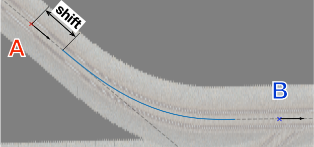

==================
CurveTrack Solver
==================

はじめに
========

このセクションでは、Measureウィンドウの機能の一つである :ref:`CurveTrack Solver <ref_measure_ctsolver>` について、いくつかの使用シーンごとに使用手順を紹介します。

.. note::

   文章作成環境の都合上、tsutsuji trackcomputerのスクリーンショットをmacOS上で撮影しています。
   Windows上で動作させた場合と若干インターフェースの見た目が異なることをあらかじめご了承ください。
   動作はmacOS/Windowsで全く変わりません。

航空写真から曲線半径・曲線長を求める
==================================

:doc:`背景画像 <tutorial_backimg>` として表示した航空写真や地図上に記された曲線軌道から曲線半径・曲線長を計算します。
基本的な使い方は次の通りです。

1. カーソルAのPos., Dir.を曲線軌道の始点に合わせる
2. カーソルBのPos., Dir.を曲線軌道の終点に合わせる
3. Mode を次のどちらかに設定してDo Itをクリックする

   1. α(fix)->β(free), R(free)
   2. α(free)->β(fix), R(free)

.. image:: ./files/tutorial/ctsolver_fitradius.png
	   :scale: 60%

これで、カーソルA, B間を結ぶ最適な曲線軌道の曲線半径・曲線長が計算されます。
計算結果はプロットウィンドウに図示され、同時に、計算に用いた各種パラメータと、Curve構文で表した計算結果がターミナルに表示されます。
以下、プロットウィンドウの表示例とターミナルへの出力例を示します。

.. image:: ./files/tutorial/ctsolver_mode1.png
	   :scale: 40%

.. code-block:: text

    [Curve fitting]
    Inputs:
    Fitmode:          1. α(fix)->β(free), R(free)
    Cursor α,β:       A,B
    Ponint α:         (45.009866, -8.697464)
    Ponint β:         (127.091985, -4.112291)
    Direction α:     6.968257
    Direction β:     -0.082262
    Transition func.: line
    TCL α:            0.000000
    TCL β:            0.000000
    Results:
    R:   -621.953334
    CCL: 76.534326
    endpt:            (121.357858, -4.104058)
    shift from pt. β: -5.734133

    $pt_a;
    Curve.SetFunction(1);
    Curve.Interpolate(0.000000,0.000000);
    $pt_a +0.000000;
    Curve.Interpolate(-621.953334,0.000000);
    $pt_a +76.534326;
    Curve.Interpolate(-621.953334,0.000000);
    $pt_a +76.534326;
    Curve.Interpolate(0.000000,0.000000);

.. note::

   曲線の始点・終点へカーソルを合わせることが難しい場合は、プロットウィンドウのY Mag.を変更するとある程度合わせやすくなります。
   上記の例では、Y Mag. = 7として、注目している軌道と直交する座標を拡大して、軌道の曲率を見かけ上大きくしています。
   
   なお、この方法は、軌道の方向がx軸と平行でない場合はあまり効果がないので注意してください。

   
計算Modeについて
--------------------

前節では計算Modeとして1. α(fix)->β(free), R(free), 2. α(free)->β(fix), R(free)の2つを挙げました。
1.はカーソルAを始点としてカーソルBの延長線上に終点をもつ曲線を求めるモード、2.はカーソルBを終点としてカーソルAの延長線上に始点をもつ曲線を求めるモード(1.の逆)です。

Mode 1,2の概略図を次に示します。

.. image:: ./files/tutorial/ctsolver_mode1-2.png
	   :scale: 60%

原理的には、カーソルA,Bが曲線軌道の端点に一致していれば、Mode1,2の計算結果は一致します。
しかし実際には、2つのカーソルを曲線軌道の端点に正確に合わせることは難しく、上図で示したように2つの計算結果が一致しない可能性は高くなります。
（ここでは、カーソルBが曲線軌道の終点から左側にずれている場合を示しています）

Mode1,2は、合わせやすい側のカーソルを端点に正確に配置し、反対側のカーソルは端点の延長線上にアバウトに配置して、状況に合ったModeを選んで計算する、という使い方を想定しています。
		   
..
   原理的には、カーソルA,Bが曲線軌道の端点に一致していれば、Mode1,2の計算結果は一致します。
   しかし実際には、2つのカーソルを曲線軌道の端点に正確に合わせることは難しく、結果として目的の曲線軌道に一致しない計算結果が得られる可能性は高くなります。

   上図では、カーソルBが曲線軌道の終点から左側にずれている場合を示しています。

   これを逆手にとって、合わせやすい側のカーソルを端点に正確に配置し、反対側のカーソルは端点の延長線上にアバウトに配置して、Mode 1,2から状況に合ったものを選んで計算する、という使い方を想定しています。
		   
なお、各Modeの内容については :ref:`こちら<ref_measure_ctsolver_mode>` も参照してください。

緩和曲線の扱い
--------------

デフォルトでは、上記の手順で計算される軌道は単純な円軌道で、始点・終点に緩和曲線は付いていません。

緩和曲線のついた曲線軌道を求める場合は、TCL α, TCL βフィールドにそれぞれの側の緩和曲線長さを入力し、逓減関数をline/sinから選んでDo Itを実行します。

なお、Version 1.2.0では、緩和曲線長さを自動で求める機能は未実装です。
(1) 一旦単純な円軌道として計算して、得られた曲線半径と該当区間の運転速度から緩和曲線長を推定する、(2) 実地・文献調査で得た値を使う、(3) 適当な値を入力して計算を何度か行い最適値を見つける、などの方法で対応してください。

.. note::

   略語について

   * TCL: Transition curve length (緩和曲線長さ)
   * CCL: Circular curve length (円曲線長さ)

曲線軌道の始点・曲線長を求める
============================

事前の調査によって曲線半径がすでに判明している場合に、2つのカーソルで示した位置を結ぶ最適な曲線軌道を求める方法です。
Mode3を使って、曲線軌道の始点・曲線長を計算します。

1. カーソルAのPos., Dir.を曲線始点の延長線上に合わせる
2. カーソルBのPos., Dir.を曲線終点の延長線上に合わせる
3. Rフィールドに曲線半径を入力する

   * 必要ならTCL α, TCL βも入力する
     
4. Modeを 3. α(free)->β(free), R(fix) に設定してDo Itをクリックする

実行結果はMode1,2と同様に、プロットウィンドウとターミナルに以下のように出力されます。

ここで、 `shift` は、カーソルAから実際の曲線始点までの距離を表します。
Curve構文による出力では `shift` の値を考慮して距離程が決められています。

.. code-block:: text
   
   [Curve fitting]
   Inputs:
      Fitmode:          3. α(free)->β(free), R(fix)
      Cursor α,β:       A,B
      Ponint α:         (23.963168, -11.290718)
      Ponint β:         (153.663441, -4.187458)
      Direction α:     6.827604
      Direction β:     -0.085262
      Transition func.: line
      TCL α:            20.000000
      TCL β:            20.000000
      R:                -600.000000
   Results:
      CCL:        52.391361
      startpoint: (38.240374, -9.581287)
      shift:      14.379178

   $pt_a +14.379178;
   Curve.SetFunction(1);
   Curve.Interpolate(0.000000,0.000000);
   $pt_a +34.379178;
   Curve.Interpolate(-600.000000,0.000000);
   $pt_a +86.770539;
   Curve.Interpolate(-600.000000,0.000000);
   $pt_a +106.770539;
   Curve.Interpolate(0.000000,0.000000);
   
他の軌道への合流
===============

下図の様に、右に向かって近づきつつある2つの軌道を、(A) 一つの軌道に合流させる、(B) 一定の間隔を保って並走させる場合の手順を説明します。
ここで、上側の軌道を `up` 、下側の軌道を `down` とします。

.. image:: ./files/tutorial/ctsolver_merging.png
	   :scale: 50%

1. カーソルAを軌道 `up` の右端に合わせる
   
   i. カーソルAのTrackリストから `up` を選択する
      
      * .. image:: ./files/tutorial/ctsolver_trackmenu.png
	           :scale: 60%
		
      * これで、カーソルは軌道 `up` 上の点のみを移動できる様になる
      
   ii. Pos.をクリックしてカーソルAの位置を指定する
   iii. dir.をクリックしてカーソルAを右向きに設定する

2. カーソルBを軌道 `down` の適当な位置に合わせる

   i. カーソルBのTrackリストから `down` を選択する
   ii. Pos.をクリックしてカーソルBの位置を指定する

       * 合流地点の距離程が分かっている場合は、次の手順を使う

	 I. カーソルBのkilopostフィールドに距離程の値を入力する
	 II. Val.をクリックする

   iii. dir.をクリックしてカーソルBを右向きに設定する

3. カーソルBの位置を平行移動する

   * (B)一定の間隔を保って並走させる場合のみ実行する
   i. カーソルBのRel.にチェックを入れる
   ii. Val.をクリックする
   iii. 表示されたset offsetウィンドウに、カーソルを平行移動させる距離を入力する

	* ここではy = -3.8 [m]とする
	* .. image:: ./files/tutorial/ctsolver_val.png
	             :scale: 60%
	* set offsetでは以下の座標系を使うことに注意する

	  * .. image:: ./files/cursor_setoffset_coordinate.png
	  * 詳細は :doc:`reference_measure` を参照
	
   iv. カーソルBが複線間隔分平行移動する

       * .. image:: ./files/tutorial/ctsolver_cursoroffset.png

4. CurveTrack Solverの適当なModeを選択して、Do Itをクリックする

   * Mode選択の考え方
     
     * 曲線軌道の始点をカーソルAに合わせたいときはMode 1
     * 曲線軌道の終点をカーソルBに合わせたいときはMode 2
     * 曲線軌道の半径を指定したいときはMode 3
	
   * カーソルA,Bの位置関係によっては、条件を満たす軌道を計算できない場合があるので注意する

     * 今回の場合はMode2で起きやすい
     * その様な場合、カーソルBの位置を調整する

       * 今回の場合は画面右側にずらす

.. _tutorial_ctsolver_crossover:

渡り線
========

下図の様に、複線軌道に片渡り線を追加する手順を説明します。
ここでは、上側軌道: `up`, 下側軌道: `down`, 渡り線: `cross` とします。
また、複線間隔は3.8mとし、分岐器として狭軌の8番分岐器を想定しています。

サンプルデータを :download:`tutorial_ctsolver_cross_sample.zip (3.0 KB) <./files/tutorial/tutorial_ctsolver_cross_sample.zip>` からダウンロードできます。
tsutsujiでco.cfgファイルを読み込むと、下図下側の線形が表示されます。

.. image:: ./files/tutorial/ctsolver_crossover.png
	   :scale: 50%

1. 渡り線の始点にカーソルAをセットする

   i. カーソルAのTrackリストから `up` を選択してpos.をクリックし、位置をセットする
   ii. dir.をクリックしてカーソルAを右向きにセットする

2. 1つ目の分岐器を計算する
   
   * .. image:: ./files/tutorial/ctsolver_crossover_switch1.png
                :scale: 60%
			
   i. カーソルα, βにA, Bが指定されていることを確認する
   ii. **Assign results to cursorにチェックを入れる**
   iii. TCLα = 0, TCLβ = 0, CCL = 14.73, R = 118.0 を入力
   iv. Modeとして **4. α(fix), R(fix), CCL(fix)** を選択してDo Itをクリック
   v. カーソルAを起点とした曲線軌道が計算され、軌道終点にカーソルBがセットされる
       
      * .. image:: ./files/tutorial/ctsolver_crossover_switch1_result.png
                   :scale: 60%

      * ターミナル出力は :ref:`こちら<tut_ctsolver_co_sw1>`

3. 2つ目の分岐器を計算する

   i. **カーソルα, βにC, Bをセットする**
   ii. TCLα = 0, TCLβ = 0, CCL = 14.73, R = **-118.0** を入力
   iii. **カーソルC** を軌道 `down` の適当な位置にセットする
   iv. Modeとして **3. α(free)->β(free), R(fix)** を選択してDo Itをクリック
   v. カーソルB, Cを接線とする曲線軌道が計算される
       
      * .. image:: ./files/tutorial/ctsolver_crossover_switch2_result.png
                   :scale: 60%

      * ターミナル出力は :ref:`こちら<tut_ctsolver_co_sw2>`
      * ここで、shift = 15.77 m は、1つ目の分岐器終点(カーソルB)から2つ目の分岐器始点までの距離を表す

4. 計算結果をもとにして渡り線のマップファイルを作成する

   * .. code-block:: text
		
	BveTs Map 2.02:utf-8

	$pt_a = 0;

	$pt_a +0.000000;
	Curve.SetFunction(1);
	Curve.Interpolate(0.000000,0.000000);
	$pt_a +0.000000;
	Curve.Interpolate(118.000000,0.000000);
	$pt_a +14.730000;
	Curve.Interpolate(118.000000,0.000000);
	$pt_a +14.730000;
	Curve.Interpolate(0.000000,0.000000);

	$pt_a = 14.73;

	$pt_a +15.771322;
	Curve.SetFunction(1);
	Curve.Interpolate(0.000000,0.000000);
	$pt_a +15.771322;
	Curve.Interpolate(-118.000000,0.000000);
	$pt_a +30.501322;
	Curve.Interpolate(-118.000000,0.000000);
	$pt_a +30.501322;
	Curve.Interpolate(0.000000,0.000000);

ターミナル出力例
---------------
      
.. _tut_ctsolver_co_sw1:

分岐器1つ目

.. code-block:: text

   [Curve fitting]
   Inputs:
      Fitmode:          4. α(fix), R(fix), CCL(fix)
      Cursor α:         A
      Ponint α:         (100.000000, -3.800000)
      Direction α:      0.000000
      Transition func.: line
      TCL α:            0.000000
      TCL β:            0.000000
      CCL:              14.730000
      R:                118.000000
   Results:
      endpoint: (114.691774, -2.881817)
      phi_end:  7.152261

   [Distance between Point A and B]
   Inputs:
      Ponint A: (100.000000, -3.800000), kp = 100.000000
      Ponint B: (114.691774, -2.881817), kp = 0.000000
   Result:
      distance: 14.7

   [Direction toward Point A to B]
   Inputs:
      Dircection A: 0.000000
      Dircection B: 7.152261
   Result:
      direction:    7.2

   $pt_a +0.000000;
   Curve.SetFunction(1);
   Curve.Interpolate(0.000000,0.000000);
   $pt_a +0.000000;
   Curve.Interpolate(118.000000,0.000000);
   $pt_a +14.730000;
   Curve.Interpolate(118.000000,0.000000);
   $pt_a +14.730000;
   Curve.Interpolate(0.000000,0.000000);

.. _tut_ctsolver_co_sw2:

分岐器2つ目

.. code-block:: text

   [Curve fitting]
   Inputs:
      Fitmode:          3. α(free)->β(free), R(fix)
      Cursor α,β:       B,C
      Ponint α:         (114.691774, -2.881817)
      Ponint β:         (150.000000, 0.000000)
      Direction α:     7.152261
      Direction β:     0.000000
      Transition func.: line
      TCL α:            0.000000
      TCL β:            0.000000
      R:                -118.000000
   Results:
      CCL:        14.730000
      startpoint: (130.340376, -0.918183)
      shift:      15.771322

   $pt_a +15.771322;
   Curve.SetFunction(1);
   Curve.Interpolate(0.000000,0.000000);
   $pt_a +15.771322;
   Curve.Interpolate(-118.000000,0.000000);
   $pt_a +30.501322;
   Curve.Interpolate(-118.000000,0.000000);
   $pt_a +30.501322;
   Curve.Interpolate(0.000000,0.000000);

   
..
   待避線
   =======

