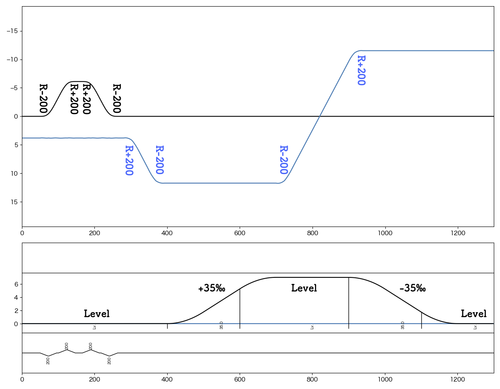
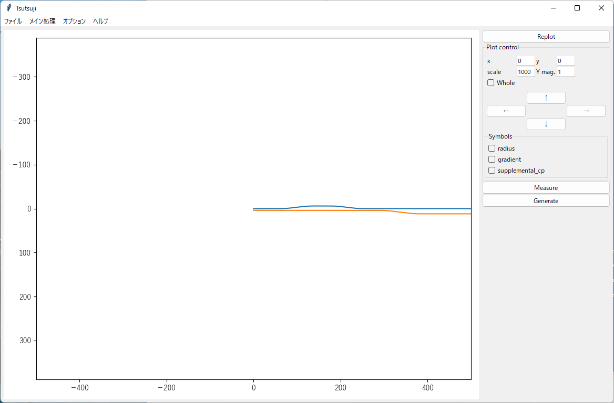
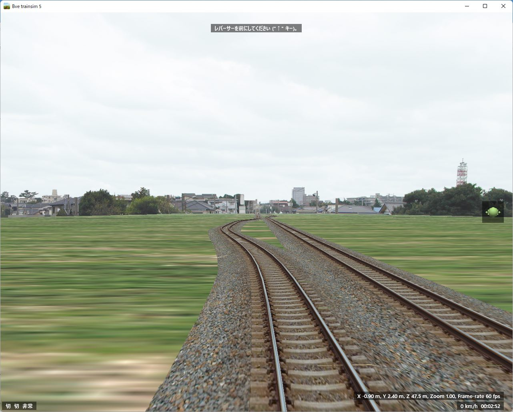
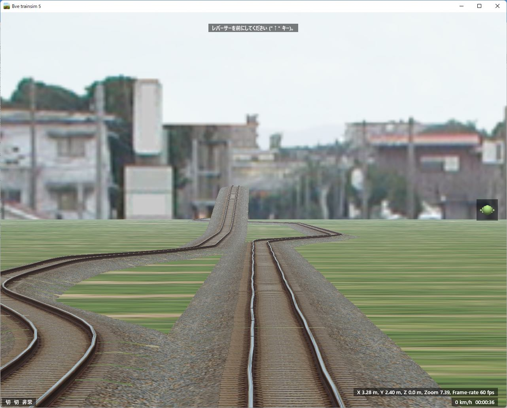
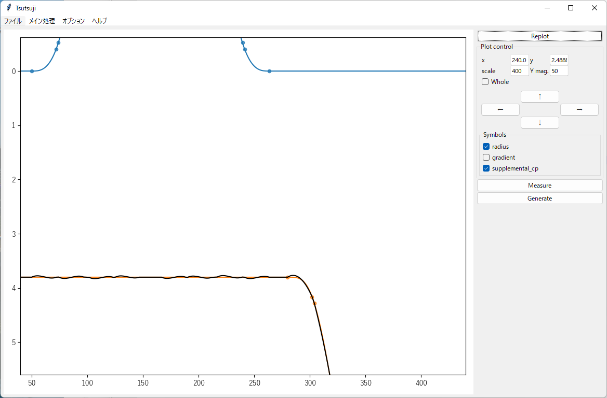
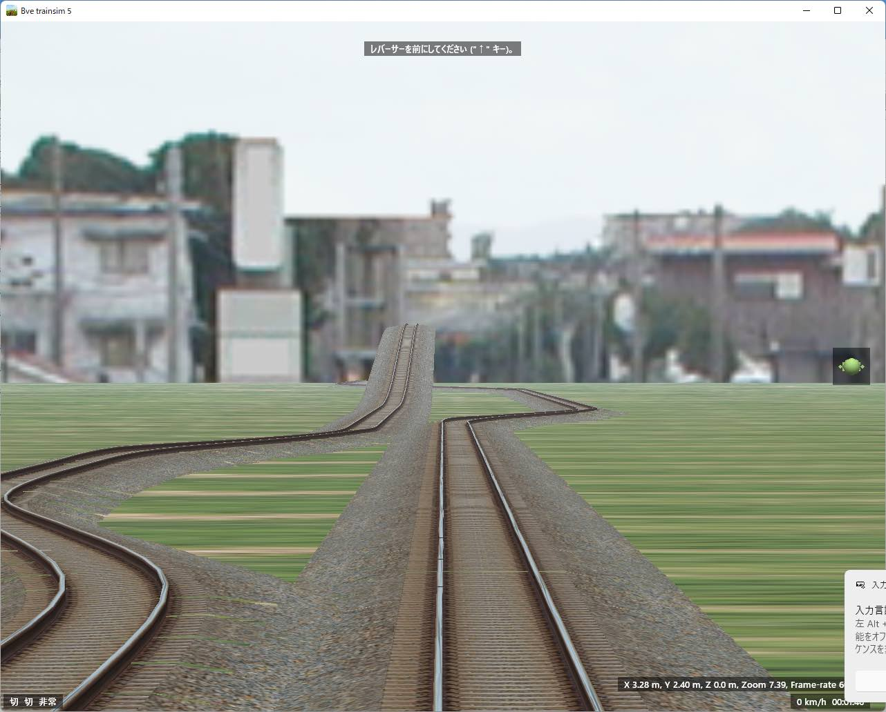
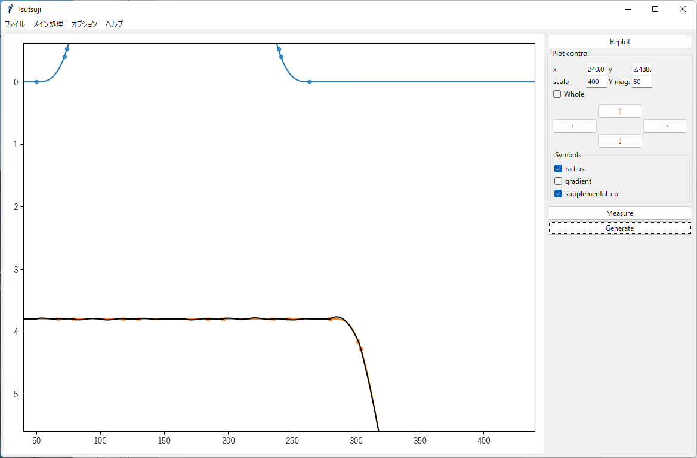

==========
基本機能
==========

はじめに
========

ここでは以下のような路線の制作を例に、Tsutsuji Trackcomputerの基本的な使い方を説明します。
以下、黒線: up, 青線: downとして、upを自軌道としてdownを他軌道に変換する手順を見ていきます。

.. note::
   
   本Tutorialで用いるサンプルファイルは全て :download:`tsutsuji_tutorial_material.zip (1.0 MB) <./files/tutorial/tsutsuji_tutorial_material.zip>` からダウンロードできます。

   このzipファイルには、本Tutorialのデータを元に作成したサンプルシナリオが入っています。
   サンプルシナリオ用のストラクチャーデータとして、https://bvets.net/jp/edit/tutorial/putstructs.html で公開されている strpack1.zipの内容物を同梱しています。
   strpack1.zipを公開いただいたmackoy氏に感謝いたします。

軌道毎のマップファイル作成
=======================

まず、軌道毎にマップファイルを作成します。
最終的に他軌道となるものも含めて、全ての軌道を自軌道として記述していきます。

フォーマットは普通のマップファイルと同様です。
最初の行にはマップファイルのヘッダーが必要です。
また、普通のマップファイルと同様に、変数、演算子、他ファイルのincludeが有効です。

.. note::
   
   Tsutsujiに入力するマップファイルでは、自軌道に関係しない要素はすべて無視されます。
   Curve, Gradient以外の要素を書いてもエラーにはなりませんが、最終的に出力されるファイルには反映されませんので注意してください。

   また、変数、演算子類は計算後の値が出力され、元の記述は保存されません。
   入力マップファイルに :code:`$hoge = 100; $hoge + 50/2;` という記述があった場合は、出力ファイルでは :code:`125;` に置き換わります。
      

up.txt
-------

.. code-block:: text
   
   BveTs Map 2.02:utf-8

   0;
   Curve.SetGauge(1.067);
   Curve.SetFunction(1);

   50;
   Curve.BeginTransition();
   Curve.SetCenter(-1.067/2);
   72;
   Curve.Begin(-200,-0.07);
   74;
   Curve.BeginTransition();
   96;
   Curve.End();

   101;
   Curve.BeginTransition();
   Curve.SetCenter(1.067/2);
   123;
   Curve.Begin(200,0.07);
   125;
   Curve.BeginTransition();
   147;
   Curve.End();

   distance + 20;
   Curve.BeginTransition();
   distance + 22;
   Curve.Begin(200,0.07);

   distance + 2;
   Curve.BeginTransition();
   distance + 22;
   Curve.End();

   distance + 5;
   Curve.BeginTransition();
   Curve.SetCenter(-0.5335);
   distance + 22;
   Curve.Begin(-200,-0.07);

   distance + 2;
   Curve.BeginTransition();
   distance + 22;
   Curve.End();

   400;
   Gradient.BeginTransition();
   500;
   Gradient.Begin(35);
   600;
   Gradient.BeginTransition();
   700;
   Gradient.End();

   900;
   Gradient.BeginTransition();
   1000;
   Gradient.Begin(-35);
   1100;
   Gradient.BeginTransition();
   1200;
   Gradient.End();

down.txt
---------

.. code-block:: text
   
   BveTs Map 2.02:utf-8

   0;
   Curve.SetGauge(1.067);
   Curve.SetFunction(0);

   280;
   Curve.BeginTransition();
   Curve.SetCenter(1.067/2);
   302;
   Curve.Begin(200,0.07);
   304;
   Curve.BeginTransition();
   326;
   Curve.End();

   346;
   Curve.BeginTransition();
   Curve.SetCenter(-1.067/2);
   368;
   Curve.Begin(-200,-0.07);
   370;
   Curve.BeginTransition();
   392;
   Curve.End();

   $foo = 700;
   $foo;
   Curve.BeginTransition();
   Curve.SetCenter(-1.067/2);
   $foo + 22;
   Curve.Begin(-200,-0.07);
   $foo + 24;
   Curve.BeginTransition();
   $foo + 46;
   Curve.End();

   $bar = 894;
   $bar;
   Curve.BeginTransition();
   Curve.SetCenter(1.067/2);
   $bar + 22;
   Curve.Begin(200,0.07);
   $bar + 24;
   Curve.BeginTransition();
   $bar + 46;
   Curve.End();

cfgファイルの作成
==================

次にcfgファイルを作成します。
Tsutsujiはこのcfgファイルの内容に従って軌道毎のマップファイルを処理します。
詳しくは :doc:`cfgfileformat` を参照してください。

ファイル名に制限はありません。ここでは tutorial.cfg とします。

この内容で、upを自軌道として、出発点で右3.8mのところにdown軌道が並走するマップが作成されます。

tutorial.cfg
-------------

.. code-block:: text

   [@TSUTSUJI_GENERAL]
   owntrack = up
   unit_length = 1
   origin_distance = 0
   offset_variable = hoge

   [up]
   file = up.txt
   absolute_coordinate = True
   x = 0
   y = 0
   z = 0
   angle = 0
   endpoint = 1500

   [down]
   file = down.txt
   absolute_coordinate = True
   x = 3.8
   y = 0
   z = 0
   angle = 0
   endpoint = 1500

各セクションの説明
----------------

[@TSUTSUJI_GENERAL]
^^^^^^^^^^^^^^^^^^^^

変換結果の出力に関係する設定を記述するセクションです。

1つのcfgファイルに対して必ず記述が必要です。

各要素の意味は次の通りです。

* owntrack

  * 自軌道として扱う軌道キー

* unit_length

  * 各軌道について、軌道座標を計算する距離程の間隔

* offset_variable

  * 変換後のデータについて、距離程を :code:`$offset_variable + 起点からの距離;` の形式で表す場合の変数名
  
* orign_distance

  * offset_variableで指定した変数に代入する数値

[up], [down]
^^^^^^^^^^^^^

各軌道の設定を記述するセクションです。

[]内に割り当てる軌道キーを記述します。軌道キーはマップファイルの名称と異なっていても構いません。

各要素の意味は次の通りです。

* file
  
  * マップファイルへのファイルパス
  * 相対パスでの指定も可能
  * このtutorial.cfgでは、同じディレクトリにマップファイルが置かれていることを想定

* absolute_coordinate

  * 軌道の始点(距離程=0mの座標)を指定する方法を記述
  * Trueとした場合、各軌道に依存しない絶対座標系で指定する

* x, y, z

  * 軌道始点の座標
  * 単位は[m]
  * 座標軸の取り方は以下を参照

.. image:: ./files/coordinate.png
	   :scale: 75%

* angle

  * 軌道始点での進行方向
  * 上図でのφに相当
  * 単位は[°]
    
    * z軸方向を0°とする

* endpoint

  * 軌道計算を終了する距離程
  * 単位は[m]

Tsutsujiの起動〜マップファイルの出力
=================================

Tsutsujiを起動します。
コマンドラインで :code:`python -m tsutsuji` を実行して、メニューの「開く」コマンドでtutorial.cfgを選択すれば、以下のウィンドウが現れます。

:code:`python -m tsutsuji tutorial.cfg` として、起動時に開くファイルを直接指定することも可能です。

.. note::

   次の手順で、軌道平面プロットの表示範囲を変更できます。

   1. 描画中心にする座標をx,yフィールドに入力
   2. 表示倍率(x軸の範囲)をscaleフィールドに入力
   3. "Replot"を実行

変換実行
--------

ウィンドウ右の **Generate** を実行すると、cfgファイルの記述に基づいて軌道情報をマップファイルに変換します。
変換結果は他軌道ごとに1つのファイルに分割され、"result"ディレクトリ内に保存されます。
"result"ディレクトリは、cfgファイルと同じ階層に作成されます。

今回出力される "down_converted.txt" の内容は以下の通りです。

down_converted.txt
^^^^^^^^^^^^^^^^^^

.. code-block:: text

   BveTs Map 2.02:utf-8

   # offset
   $hoge = 0.000000;

   # Track['down'].X
   $hoge + 0.00;
   Track['down'].X.Interpolate(3.80,0.00);
   $hoge + 50.00;
   Track['down'].X.Interpolate(3.80,375.12);
   $hoge + 72.00;
   Track['down'].X.Interpolate(4.21,196.82);
   $hoge + 74.00;
   Track['down'].X.Interpolate(4.33,432.41);
   $hoge + 96.00;
   Track['down'].X.Interpolate(6.60,0.00);
   $hoge + 101.00;
   Track['down'].X.Interpolate(7.21,-366.39);
   $hoge + 123.00;
   Track['down'].X.Interpolate(9.41,-211.59);
   $hoge + 125.00;
   Track['down'].X.Interpolate(9.52,-439.41);
   $hoge + 147.00;
   Track['down'].X.Interpolate(9.91,0.00);
   $hoge + 167.00;
   Track['down'].X.Interpolate(9.91,-402.09);
   $hoge + 189.00;
   Track['down'].X.Interpolate(9.52,-208.56);
   $hoge + 191.00;
   Track['down'].X.Interpolate(9.41,-397.23);
   $hoge + 213.00;
   Track['down'].X.Interpolate(7.21,0.00);
   $hoge + 218.00;
   Track['down'].X.Interpolate(6.60,393.16);
   $hoge + 240.00;
   Track['down'].X.Interpolate(4.33,195.87);
   $hoge + 242.00;
   Track['down'].X.Interpolate(4.21,410.59);
   $hoge + 264.00;
   Track['down'].X.Interpolate(3.80,0.00);
   $hoge + 280.58;
   Track['down'].X.Interpolate(3.80,369.05);
   $hoge + 302.57;
   Track['down'].X.Interpolate(4.16,199.92);
   $hoge + 304.57;
   Track['down'].X.Interpolate(4.28,436.46);
   $hoge + 326.45;
   Track['down'].X.Interpolate(6.56,0.00);
   $hoge + 346.30;
   Track['down'].X.Interpolate(8.95,-356.90);
   $hoge + 368.18;
   Track['down'].X.Interpolate(11.22,-200.22);
   $hoge + 370.18;
   Track['down'].X.Interpolate(11.34,-454.42);
   $hoge + 392.17;
   Track['down'].X.Interpolate(11.71,0.00);
   $hoge + 400.00;
   Track['down'].X.Interpolate(11.71,0.00);
   $hoge + 500.00;
   Track['down'].X.Interpolate(11.71,0.00);
   $hoge + 600.00;
   Track['down'].X.Interpolate(11.71,0.00);
   $hoge + 700.00;
   Track['down'].X.Interpolate(11.71,-6475.69);
   $hoge + 700.17;
   Track['down'].X.Interpolate(11.71,-357.01);
   $hoge + 722.17;
   Track['down'].X.Interpolate(11.34,-200.21);
   $hoge + 724.16;
   Track['down'].X.Interpolate(11.22,-454.68);
   $hoge + 746.04;
   Track['down'].X.Interpolate(8.95,0.00);
   $hoge + 892.98;
   Track['down'].X.Interpolate(-8.77,1985.96);
   $hoge + 900.00;
   Track['down'].X.Interpolate(-9.61,273.00);
   $hoge + 914.86;
   Track['down'].X.Interpolate(-11.04,199.83);
   $hoge + 916.85;
   Track['down'].X.Interpolate(-11.16,425.05);
   $hoge + 938.85;
   Track['down'].X.Interpolate(-11.52,0.00);
   $hoge + 1000.00;
   Track['down'].X.Interpolate(-11.52,0.00);
   $hoge + 1100.00;
   Track['down'].X.Interpolate(-11.52,0.00);
   $hoge + 1200.00;
   Track['down'].X.Interpolate(-11.52,0.00);
   $hoge + 1498.85;
   Track['down'].X.Interpolate(-11.52,0.00);

   # Track['down'].Y
   $hoge + 0.00;
   Track['down'].Y.Interpolate(0.00,0.00);
   # ... (省略) ...
   $hoge + 392.17;
   Track['down'].Y.Interpolate(0.00,0.00);
   $hoge + 400.00;
   Track['down'].Y.Interpolate(0.00,-2875.02);
   $hoge + 500.00;
   Track['down'].Y.Interpolate(-1.75,0.00);
   $hoge + 600.00;
   Track['down'].Y.Interpolate(-5.25,2875.00);
   $hoge + 700.00;
   Track['down'].Y.Interpolate(-7.00,0.00);
   $hoge + 700.17;
   Track['down'].Y.Interpolate(-7.00,0.00);
   $hoge + 722.17;
   Track['down'].Y.Interpolate(-7.00,0.00);
   $hoge + 724.16;
   Track['down'].Y.Interpolate(-7.00,0.00);
   $hoge + 746.04;
   Track['down'].Y.Interpolate(-7.00,0.00);
   $hoge + 892.98;
   Track['down'].Y.Interpolate(-7.00,0.00);
   $hoge + 900.00;
   Track['down'].Y.Interpolate(-7.00,2831.25);
   $hoge + 914.86;
   Track['down'].Y.Interpolate(-6.96,2853.34);
   $hoge + 916.85;
   Track['down'].Y.Interpolate(-6.95,2858.11);
   $hoge + 938.85;
   Track['down'].Y.Interpolate(-6.73,2892.76);
   $hoge + 1000.00;
   Track['down'].Y.Interpolate(-5.25,0.00);
   $hoge + 1100.00;
   Track['down'].Y.Interpolate(-1.75,-2875.00);
   $hoge + 1200.00;
   Track['down'].Y.Interpolate(0.00,0.00);
   $hoge + 1498.85;
   Track['down'].Y.Interpolate(0.00,0.00);

   # Track['down'].Cant.Interpolate
   $hoge + 0.00;
   Track['down'].Cant.Interpolate(0.000);
   $hoge + 280.58;
   Track['down'].Cant.Interpolate(0.000);
   $hoge + 302.57;
   Track['down'].Cant.Interpolate(0.070);
   $hoge + 304.57;
   Track['down'].Cant.Interpolate(0.070);
   $hoge + 326.45;
   Track['down'].Cant.Interpolate(0.000);
   $hoge + 346.30;
   Track['down'].Cant.Interpolate(-0.000);
   $hoge + 368.18;
   Track['down'].Cant.Interpolate(-0.070);
   $hoge + 370.18;
   Track['down'].Cant.Interpolate(-0.070);
   $hoge + 392.17;
   Track['down'].Cant.Interpolate(-0.000);
   $hoge + 700.17;
   Track['down'].Cant.Interpolate(-0.000);
   $hoge + 722.17;
   Track['down'].Cant.Interpolate(-0.070);
   $hoge + 724.16;
   Track['down'].Cant.Interpolate(-0.070);
   $hoge + 746.04;
   Track['down'].Cant.Interpolate(-0.000);
   $hoge + 892.98;
   Track['down'].Cant.Interpolate(0.000);
   $hoge + 914.86;
   Track['down'].Cant.Interpolate(0.070);
   $hoge + 916.85;
   Track['down'].Cant.Interpolate(0.070);
   $hoge + 938.85;
   Track['down'].Cant.Interpolate(0.000);
   $hoge + 1498.85;
   Track['down'].Cant.Interpolate(0.000);

   # Track['down'].Cant.SetFunction
   $hoge + 0.00;
   Track['down'].Cant.SetFunction(0);
   $hoge + 1498.85;
   Track['down'].Cant.SetFunction(0);

   # Track['down'].Cant.SetCenter
   $hoge + 0.00;
   Track['down'].Cant.SetCenter(0.000);
   $hoge + 280.58;
   Track['down'].Cant.SetCenter(0.533);
   $hoge + 346.30;
   Track['down'].Cant.SetCenter(-0.533);
   $hoge + 700.17;
   Track['down'].Cant.SetCenter(-0.533);
   $hoge + 892.98;
   Track['down'].Cant.SetCenter(0.533);
   $hoge + 1498.85;
   Track['down'].Cant.SetCenter(0.533);

   # Track['down'].Cant.SetGauge
   $hoge + 0.00;
   Track['down'].Cant.SetGauge(1.067);
   $hoge + 1498.85;
   Track['down'].Cant.SetGauge(1.067);

サンプルシナリオについて
======================

このtutorialで用いたデータを元に作成したサンプルシナリオが、このページ冒頭で触れたtsutsuji_tutorial_material.zipに同梱されています。
始点付近でのスクリーンショットは以下の通りです。
Bve trainsimで読み込めば、緩和曲線や勾配導入部での縦曲線を含むマップがそれらしく変換されていることを見ていただけるかと思います。

もう少し手を加える
----------------

さて、運転台からは「それらしく」見えているサンプルシナリオですが、望遠ズームしてみると粗が目立ってきます。

上図は、サンプルシナリオ出発点にてdown軌道上を7倍にズームしたときのスクリーンショットです。
直線であるはずのdown軌道が左右に歪んでいるのがわかります。

この歪みはTsutsujiのプロットウィンドウ上でも確認できます。
上図の黒い軌道が他軌道に変換した結果を表していますが、直線であるオレンジ色の軌道に対して上下に歪んでいることがわかります。
（ここでは歪みを強調するため、プロットのy軸方向を50倍に拡大しています）

これは、down軌道を指定するTrack構文の設置間隔が、down軌道の相対曲率半径の変化に対して少なすぎることが原因で、改善するにはTrack構文を適当な箇所に増設する必要があります。
ここでは、down軌道基準の距離程で60m, 85m, 112m, 137m, 177m, 203m, 228m, 250mの位置にTrack構文を増設してみます。（これで、おおむね10m間隔でTrack構文が設置されます）

Track構文を増設するには、tutorial.cfgの[down]セクションに :code:`supplemental_cp` 要素を追加します。
:code:`supplemental_cp = 60,85,112,137,177,203,228,250` をtutorial.cfgの[down]セクションに追加し、Tsutsujiの出力ファイルをBve trainsimで読み込むと、下図のとおり歪みが軽減されたdown軌道が得られます。

.. note::
   
   キツめに拡大しているせいか、プロットウィンドウ上で比較するとあんまり軽減されていないようにも見えます。
   この辺は厳密に追い込まずに、BVE本体で見たときに違和感がない程度に調整すれば十分なのかもしれません。

[おわり]
