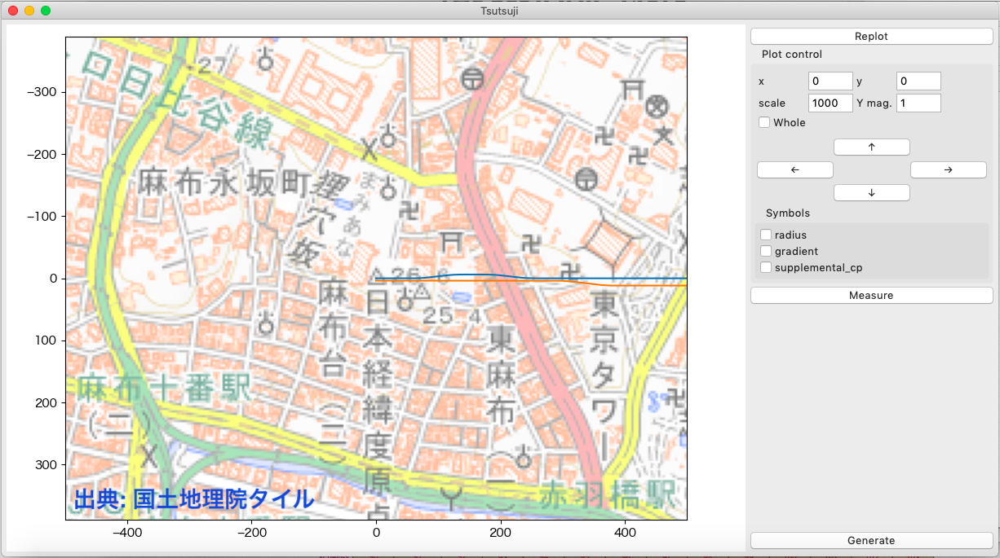
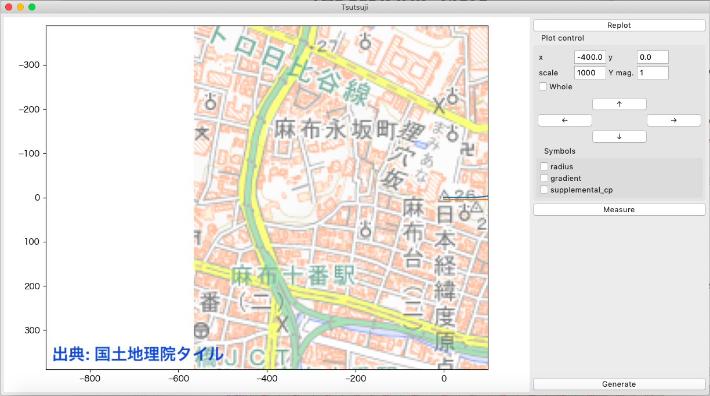

=========
Maptile
=========

はじめに
=========

このセクションでは、国土地理院、OpenStreetMapなどが提供するマップタイルを、プロットウィンドウの表示範囲に合わせて自動で取得・表示するMaptile機能の使用手順を紹介します。

マップタイル自体の説明については、例えば `国土地理院 地理院タイルについて <https://maps.gsi.go.jp/development/siyou.html>`_ を参照してください。

**マップタイルの利用に際しては、それぞれのタイル提供元の利用規約に従ってください。** 

基準点の座標を調べる
===================

最初に、Tsutsuji上の点(x0, y0)に対応するマップタイル上の地点の緯度・経度を調べます。
デフォルトでは、(x0, y0) = (0, 0)ですが、必要に応じてx0, y0の値は自由に変更できます。

`地理院地図 <https://maps.gsi.go.jp/>`_ で調べる場合は、調べたい地点をウィンドウ中央に表示して、画面左下の↗️アイコンをクリックすると座標情報が表示されます。

`Google マップ <https://www.google.co.jp/maps>`_ で調べる場合は、調べたい地点で右クリックすると座標情報が表示されます。

.. note::
   
   緯度・経度は10進数で表わされている必要があります。
   入手したデータが度(°), 分(′), 秒(″)で表されている場合は、次の式によって変換してください。

   変換式: :math:`a^\circ b^\prime c^{\prime\prime}` に対して :math:`a + (b + \frac{c}{60})/{60} \mathrm{[deg]}`

cfgファイルの準備
=================

用意した座標データをもとに、cfgファイルの[@MAPTILE]セクションに関係するパラメータを記述します。
記述例は以下の通りです。
設定できるパラメータの詳細は :ref:`ref_cfg_maptile` を参照してください。

.. code-block:: text

   [@MAPTILE]
   longitude = 139.741357472222222 # 経度
   latitude = 35.6580992222222222 # 緯度
   x0 = 0
   y0 = 0
   alpha = 0.5
   zoomlevel = 15
   template_url = https://cyberjapandata.gsi.go.jp/xyz/std/{z}/{x}/{y}.png

.. note::

   「# 経度」、「# 緯度」のコメントは説明のために追加したものです。このままcfgファイルにコピー＆ペーストするとエラーになりますので、適宜削除してください。
   
なお、オプションメニューからMaptile...を実行すれば、cfgファイルを編集せずにmaptileパラメータを設定できます。
この際、toshowチェックボックスを選択することを忘れないでください。
チェックが入っていない場合、マップタイルが取得・表示されません。

.. image:: ./files/maptileparamwindow.png
	   :scale: 60%

テンプレートURLについて
---------------------

国土地理院タイルを使う場合、主なテンプレートURLは以下の通りです。
その他の国土地理院タイルについては https://maps.gsi.go.jp/development/ichiran.html を参照してください。

* 標準地図: `https://cyberjapandata.gsi.go.jp/xyz/std/{z}/{x}/{y}.png`
* 空中写真: `https://cyberjapandata.gsi.go.jp/xyz/seamlessphoto/{z}/{x}/{y}.jpg`

なお、XYZ形式で表されたマップタイルであれば、国土地理院タイル以外のサービスも利用できるはずです。

tsutsuji上での操作方法
=====================
   
:doc:`Tutorial 基本機能 <tutorial_first>` で紹介したサンプルcfgファイルに、上記の[@MAPTILE]セクションを追加すると、Tsutsujiのプロットウィンドウは以下のようになります。

この状態から、矢印キーでx軸負の方向に移動すると、やがて下図のように取得したマップタイルの範囲外に到達します。
新しいマップタイルを取得するには、オプションメニューからRefresh Maptile(ショートカット: Shift + Enter)を実行します。
矢印キーやscale、Y mag.の値によるプロット範囲の変更と、新しいマップタイルの取得は連動していませんので、必要に応じてRefresh Maptileを実行してください。

ズームレベルの選択
-----------------

マップタイルでは、ズームレベルという数値によってタイルの縮尺を表現しており、ズームレベルが1増えるごとに、タイル1枚の縮尺が1/2となります。
ズームレベルとタイル一辺の距離には、大まかに次の表の関係があります。
（基準となる緯度・経度によって値は若干変化します）

.. csv-table::
   :header: "ズームレベル", "タイル一辺が表す距離 [m]"

	    "13", "3962"
	    "14", "1980"
	    "15", "990"
	    "16", "495"
	    "17", "247"
	    "18", "123"

Maptile機能では、プロット範囲を埋め尽くすのに必要な複数のマップタイルを取得して、それらをつなぎ合わせて背景画像として表示しています。
プロット範囲とズームレベル次第では、一度に多数のタイルを取得する必要があります。
全てのタイルが表示されるまでに長時間を要する場合もあるので、ズームレベルの設定には注意してください。

途中でズームレベルを変更する場合は、オプションメニューからMaptile...を実行すれば、ズームレベルを含めMaptileに関する全てのパラメータを変更できます。
また、autozoomを有効化すると、現在のプロットウィンドウ表示範囲に合わせてズームレベルを自動で選択します。(ver. 1.4.1より)
