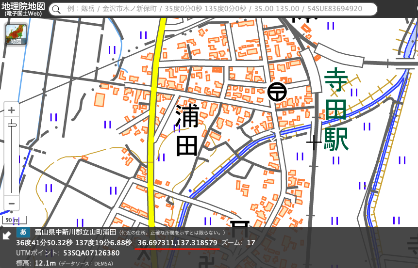
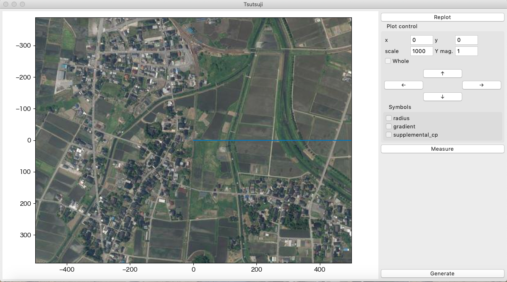
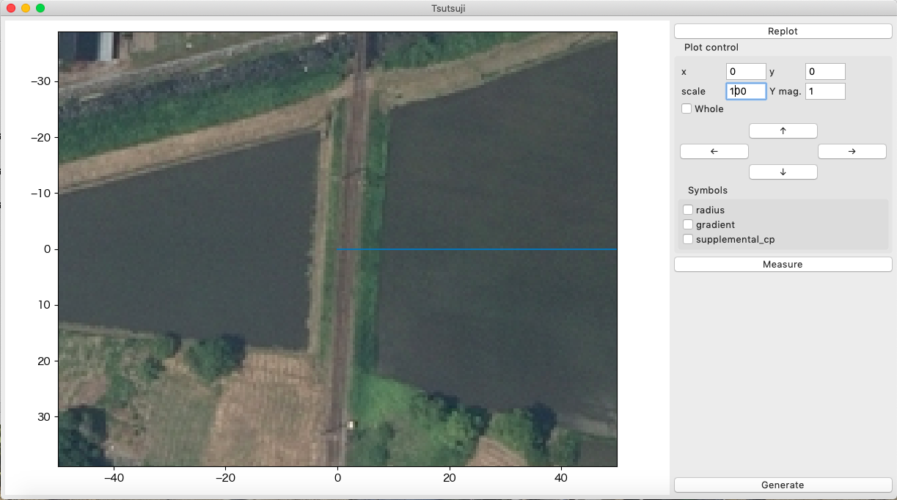
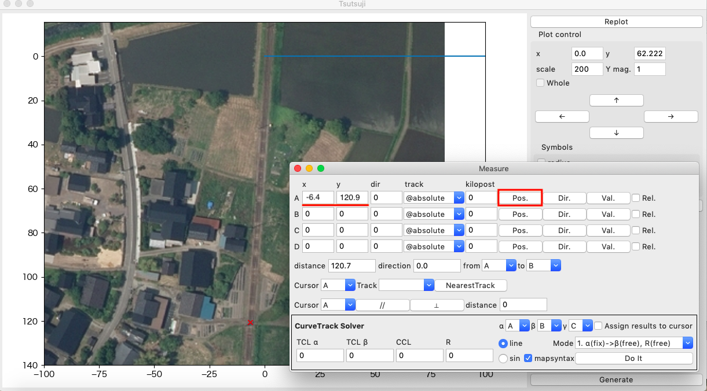

==========================
空中写真をTsutsujiに表示する
==========================

経緯度を調べる
==============

1. `地理院地図 <https://maps.gsi.go.jp/>`_ で `寺田駅付近 <https://maps.gsi.go.jp/#17/36.697311/137.318579/&base=std>`_ を表示する
2. 画面中央のクロスマークをTsutsuji上での座標原点にしたい場所に合わせる
   
   - 今回は立山線立山方に設定

     - 経度: 36.69731055253167
     - 緯度: 137.31857900872157
     
3. ウィンドウ左下の↗️アイコンをクリックして、表示された経緯度を読み取る

   - googleマップで調べたい場所を右クリックしてメニュー最上段に表示される経緯度を使ってもよい

     - googleマップの方が経緯度の有効数字が大きいので今回はこちらの値を使用

CFGファイルの作成
================

1. 同じディレクトリに下記の内容でmain.cfg, tateyama_up.txtを作成する

2. 作成したmain.cfgをTsutsujiで読み込む

   - 下図のように空中写真がメインウィンドウ上に表示される
   - 座標(0, 0)を起点としてtateyama_up軌道がx正の方向に伸びる
  

.. code-block:: text
   :caption: main.cfg 

   [@TSUTSUJI_GENERAL]
   owntrack = tateyama_up
   unit_length = 1
   origin_distance = 0
   offset_variable = hoge

   [@MAPTILE]
   longitude = 137.31857900872157
   latitude = 36.69731055253167
   x0 = 0
   y0 = 0
   alpha = 1
   zoomlevel = 18
   template_url = https://cyberjapandata.gsi.go.jp/xyz/seamlessphoto/{z}/{x}/{y}.jpg
   toshow = True
   autozoom = True

   [tateyama_up]
   file = tateyama_up.txt
   absolute_coordinate = True
   x = 0
   y = 0
   z = 0
   angle = 0
   endpoint = 1500

.. code-block:: text
   :caption: tateyama_up.txt
	     
   BveTs Map 2.02:utf-8

   0;
   Curve.SetGauge(1.067);
   Curve.SetFunction(0);

基準座標の修正
=============

読み込まれた空中写真の原点付近を拡大すると、下図のように空中写真上の立山線線路が原点を通過していないことが分かる。
ここでは空中写真の基準座標([@MAPTILE]のx0, y0)を調整して、原点上を線路が通過するように修正する。

.. note::

   - 表示範囲の拡大は、scaleフィールドの値を書き換えてenterキー

     - scaleフィールドの値は、プロットウィンドウx軸の表示範囲を表す

   - 空中写真の更新は、shift+enterキー
     
1. Measureウィンドウを開く
2. カーソルAのPos.をクリックする
3. 表示されたxカーソルで原点を写したい場所をクリックする
4. クリックした位置の座標がカーソルAのx, yフィールドに表示される
5. 下記のようにmain.cfgを修正する

   - 測定した座標をの符号を反転させた値をx0, y0に指定する
   - 指定した距離だけ空中写真を並行移動して表示する
     
6. main.cfgを再読み込みすると、空中写真の基準座標が更新される

   - cfgファイル、マップデータの再読み込みはF5キー
		   

		   
.. code-block:: text
    :caption: main.cfg (修正部分のみ)
		
    [@MAPTILE]
    ...
    x0 = 6.4
    y0 = -120.9
    ...
