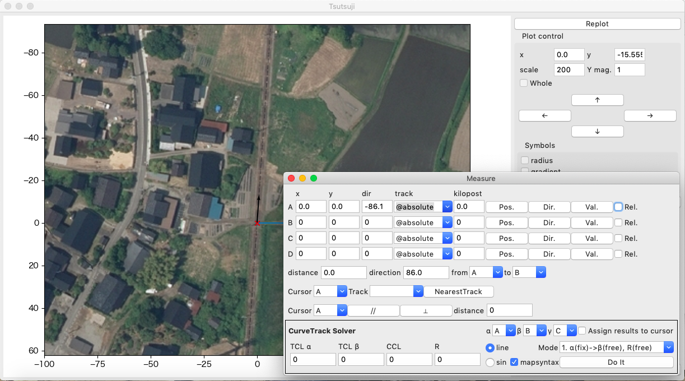

=================
tateyama_up の構築
=================

始点での向き調整
===============

空中写真に対して明後日の方向を向いているtateyama_up軌道の向きを調整する。

1. Measureウィンドウを開く

   - 以下の操作は全てカーソルAに対して行う

2. trackメニューからtateyama_upを選択する

   - これで、カーソルAの位置と方向はtateyama_up軌道上に限定される
   
3. Pos.をクリックして、カーソルをtateyama_up軌道左端(距離程: 0m)にセットする
4. trackメニューから @absolute を選択する

   - これで、カーソルAは任意の位置と方向に設定できる
     
5. Dir.をクリックして、カーソルを空中写真の線路の方向にセットする
6. dirフィールドにカーソルAの向きが表示される

   - ここでは-86.1度
   
7. 下記のようにmain.cfgを修正し、再読み込みする
8. tateyama_upの方向が空中写真と一致する

.. code-block:: text
   :caption: main.cfg

   ...
   [tateyama_up]
   ...
   angle = -86.1
   ...
   

プラットホーム部
=================

プラットホームにかかる曲線軌道を求める。

1. カーソルAのtrackをtateyama_upに設定する
2. カーソルAの位置・方向をプラットホームにかかる曲線軌道の始端にセットする
3. カーソルBのtrackを @absoluteに設定する
4. カーソルBの位置・方向を曲線軌道の終端にセットする
5. CurveTrack Solverを以下の設定にしてDo Itする

   - α: A, β: B
   - mapsyntax にチェック
   - Mode: 1. α(fix)->β(free), R(free)

    - カーソルAを起点、カーソルBの延長線上を終点とする円軌道を求める
     
6. 下図のようにカーソルA, Bを結ぶ曲線軌道(青)が得られる

   - .. image:: ./files/tateyama_up/curve_mode1.png
               :scale: 50%

緩和曲線の追加
-------------

求められた曲線軌道は空中写真上の線路よりもやや左側を通過しているように見える。
ここでは、緩和曲線を挿入して微調整を試みる。

7. カーソルCをプラットホーム中心あたりの軌道中心にセットする

   - 方向は指定しなくてもよい

8. CurveTrack Solverを以下の設定にしてDo Itする

   - γ: C
   - mapsyntax にチェック
   - Mode: 6. α(fix)->β(free) via γ, R(free)

    - カーソルAを起点、カーソルBの延長線上を終点とする円軌道に対して、カーソルCに最も近い点を通過するように緩和曲線を追加する
      
9. 下図のようにカーソルCを通過する曲線軌道(オレンジ)が得られる

   - .. image:: ./files/tateyama_up/curve_mode6.png
               :scale: 50%

10. ターミナルに出力された自軌道構文をtateyama_up.txtにコピー＆ペーストする

   - .. code-block:: text
	 :caption: tateyama_up.txt (全文)

	 BveTs Map 2.02:utf-8

	 0;
	 Curve.SetGauge(1.067);
	 Curve.SetFunction(0);

	 $pt_a = 190.000000;
	 $pt_a;
	 $cant = 0;
	 Curve.SetFunction(1);
	 Curve.Interpolate(0.000000,0);
	 $pt_a +10.184781;
	 Curve.Interpolate(-202.926975, $cant);
	 $pt_a +155.094676;
	 Curve.Interpolate(-202.926975, $cant);
	 $pt_a +165.279457;
	 Curve.Interpolate(0.000000,0);

11. データのリロード(F5)を行うと、下図を得る
    
   - .. image:: ./files/tateyama_up/form_final.png
               :scale: 50%

.. csv-table:: (参考) 各カーソルの設定値
     :header: "カーソル","x","y","dir","track","kilopost"

	      "A", 12.9, -189.6, -86.1, "tateyama_up", 190.0
	      "B", -37.7, -343.6, -129.9, "@absolute", "/"
	      "C", 3.2, -272.8, "/", "@absolute", "/"
    
    
本線との合流部
=============

電鉄富山寄りの本線との合流部にある片渡り線を構築する。

ここで、片渡り線を構成する分岐器は開き角から、下図に示すような10番片開き分岐器と仮定する。
他の箇所の分岐器も10番分岐器として扱うことにする。
(参考: `分岐器をつくる　第1回-片開き分岐器　導入編-, Eden's BVE works <http://bve-edenrailway.seesaa.net/article/444370071.html>`_)

1. カーソルAのtrackをtakayama_upに設定する
2. カーソルAの位置・方向を片渡り線始端にセットする
   
   - .. image:: ./files/tateyama_up/crossover1.png
               :scale: 50%
		       
3. CurveTrack Solverに以下のパラメータをセットしてDo Itする

   - CCL: 18.53
   - R: 185.5
   - α: A, β: B
   - Assign results to cursor にチェック
   - mapsyntax にチェック
   - Mode: 4. α(fix), R(fix), CCL(fix)

4. カーソルAを始点とした半径185.5m, 全長18.53mの曲線が求められる

   - カーソルBは曲線終点に移動する
   - .. image:: ./files/tateyama_up/crossover2.png
               :scale: 50%

5. ターミナルに出力された自軌道構文をtateyama_up.txtにコピーアンドペーストする
6. カーソルCのtrackを @absoluteとして片渡り線の終端にセットする
7. CurveTrack Solverに以下のパラメータをセットしてDo Itする

   - CCL: 18.53
   - R: -185.5
   - α: B, β: C **(要変更)**
   - mapsyntax にチェック
   - Mode: 3. α(free)->β(free), R(fix)

8. カーソルB, Cを通過する半径-185.5m, 全長18.53mの直線が求められる
   
    - .. image:: ./files/tateyama_up/crossover3.png
               :scale: 50%

9. ターミナルに出力された自軌道構文をtateyama_up.txtにコピーアンドペーストする

   - ここでコピーする自軌道構文には、カーソルBに相当する位置の距離程情報が含まれていないので、修正が必要

     - カーソルBを @absolute 設定にしているため
     
   - .. code-block:: text
       :caption: tateyama_up.txt (追加分のみ)

       ...
       $pt_a = 381.000000;
       $pt_a +0.000000;
       $cant = 0;
       Curve.SetFunction(1);
       Curve.Interpolate(0.000000,0);
       $pt_a +0.000000; #片渡り線の始点側曲線
       Curve.Interpolate(185.500000, $cant);
       $pt_a +18.530000;
       Curve.Interpolate(185.500000, $cant);
       $pt_a +18.530000;
       Curve.Interpolate(0.000000,0);

       $pt_a = 0; #この行要修正
       $pt_a +17.473817;
       $cant = 0;
       Curve.SetFunction(1);
       Curve.Interpolate(0.000000,0);
       $pt_a +17.473817; #片渡り線の終点側曲線
       Curve.Interpolate(-185.500000, $cant);
       $pt_a +36.082812;
       Curve.Interpolate(-185.500000, $cant);
       $pt_a +36.082812;
       Curve.Interpolate(0.000000,0);

10. 手順9でコピーアンドペーストした構文の距離程を修正する

   - カーソルBに相当する位置の距離程を手計算する

     - カーソルAの距離程は381.0m
     - カーソルBは分岐器曲線の終点: 距離程は381.0+18.53m
     - よって下記の通り修正できる
       
   - .. code-block:: text
         :caption: tateyama_up.txt (追加分のみ)
	 :emphasize-lines: 2, 11, 14
	    
	 ...
	 $pt_a = 381.000000;
	 $pt_a +0.000000;
	 $cant = 0;
	 Curve.SetFunction(1);
	 Curve.Interpolate(0.000000,0);
	 $pt_a +0.000000; #片渡り線の始点側曲線
	 Curve.Interpolate(185.500000, $cant);
	 $pt_a +18.530000;
	 Curve.Interpolate(185.500000, $cant);
	 $pt_a +18.530000;
	 Curve.Interpolate(0.000000,0);

	 $pt_a = 381 + 18.53; # 修正結果
	 $pt_a +17.473817;
	 $cant = 0;
	 Curve.SetFunction(1);
	 Curve.Interpolate(0.000000,0);
	 $pt_a +17.473817; #片渡り線の終点側曲線
	 Curve.Interpolate(-185.500000, $cant);
	 $pt_a +36.082812;
	 Curve.Interpolate(-185.500000, $cant);
	 $pt_a +36.082812;

   - :ref:`こちら <tutorial_ctsolver_crossover>` のように、合流側の軌道を予め敷いておくと、上記の手順を省略できる

11. データのリロード(F5)を行い、下記の完成図を得る
    
   - .. image:: ./files/tateyama_up/crossover4.png
               :scale: 50%

.. csv-table:: (参考) 各カーソルの設定値
     :header: "カーソル","x","y","dir","track","kilopost","備考"

	      "A", -53.3, -362.2, -129.9, "tateyama_up", 381.0,
	      "B", -64.4, -377.0, -124.2, "@absolute", "/", Solverによる自動設定(Measureウィンドウには非表示)
	      "C", -88.2, -409.7, -129.9, "@absolute", "/",
    
