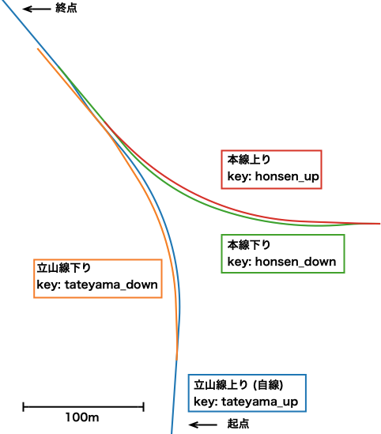

============
寺田駅を作る
============

はじめに
=========

ここでは、 `富山地方鉄道 寺田駅 <https://www.chitetsu.co.jp/?station_info=寺田駅>`_ を題材として、国土地理院の空中写真(航空写真)から線形データを作成する手順を説明します。

この作例では、立山線上り線を自軌道として構築し、これを基準に立山線下り線、本線上り・下り線をそれぞれ構築します。マップ平面図は下図の通りです。

サンプルデータは :download:`terada_sample.zip (9 KB) <./files/terada_sample.zip>` よりダウンロードできます。

	   
目次
=====

.. toctree::

   ./preparecfg
   ./tateyama_up
   
